# Adelanta - Mermaid Diagrams for Draw.io

Use these Mermaid diagrams in draw.io or any Mermaid-compatible tool.

---

## 1. Invoice Lifecycle Flow / Flujo del Ciclo de Vida de la Factura

---

## 2. Settlement Auto-Split Flow / Flujo de División Automática

```mermaid
flowchart TD
    subgraph Corporate["🏛️ Corporate Client / Cliente Corporativo"]
        A["Pay $8,000 to Bank Account<br/>Paga $8,000 a Cuenta Bancaria"]
    end
    
    subgraph Anchor["🏦 Stellar Anchor"]
        B["Receive Fiat Payment<br/>Recibir Pago Fiat"]
        C["Convert to USDC<br/>Convertir a USDC"]
        D["Send to Smart Contract<br/>Enviar a Contrato Inteligente"]
    end
    
    subgraph Contract["📜 Soroban Contract / Contrato Soroban"]
        E["Receive $8,000 USDC<br/>Recibir $8,000 USDC"]
        F["Execute Auto-Split<br/>Ejecutar División Automática"]
    end
    
    subgraph Distribution["💸 Distribution / Distribución"]
        G["Lender: $7,344<br/>Prestamista: $7,344<br/>(principal + 2% fee)"]
        H["SME: $616<br/>PYME: $616<br/>(remainder/remanente)"]
        I["Protocol: $40<br/>Protocolo: $40<br/>(0.5% fee/comisión)"]
    end
    
    A --> B
    B --> C
    C --> D
    D --> E
    E --> F
    F --> G
    F --> H
    F --> I
    
    style A fill:#FFEBEE,stroke:#C62828,stroke-width:2px
    style F fill:#E8F5E9,stroke:#2E7D32,stroke-width:2px
    style G fill:#E3F2FD,stroke:#1565C0,stroke-width:2px
    style H fill:#FFF3E0,stroke:#EF6C00,stroke-width:2px
    style I fill:#F3E5F5,stroke:#7B1FA2,stroke-width:2px
```

---

## 3. Complete User Journey Sequence / Secuencia Completa del Usuario

```mermaid
sequenceDiagram
    participant M as María (SME/PYME)
    participant A as Adelanta
    participant L as Lender/Prestamista
    participant S as Soroban Contract
    participant AN as Anchor
    participant C as Corporate/Corporativo

    rect rgb(227, 242, 253)
    Note over M,C: Phase 1: Invoice Creation / Fase 1: Creación de Factura
    M->>A: Upload Invoice / Subir Factura ($8,000)
    A->>S: Create Invoice Token / Crear Token
    S-->>A: Invoice ID + Escrow Address
    A->>A: List on Marketplace / Listar
    end

    rect rgb(232, 245, 233)
    Note over M,C: Phase 2: Funding / Fase 2: Financiamiento
    L->>A: Browse Marketplace / Explorar
    L->>S: Fund Invoice / Financiar (7,200 USDC)
    S->>M: Transfer Advance / Transferir Anticipo
    Note over M: María receives instant cash! 🎉<br/>¡María recibe efectivo instantáneo!
    end

    rect rgb(255, 243, 224)
    Note over M,C: Phase 3: Settlement / Fase 3: Liquidación (60-90 days)
    C->>AN: Pay $8,000 / Pagar (Bank Transfer)
    AN->>S: Convert & Send / Convertir y Enviar
    S->>S: Execute Auto-Split / Ejecutar División
    S->>L: Send $7,344 / Enviar (Principal + Fee)
    S->>M: Send $616 / Enviar (Remainder)
    S->>A: Send $40 / Enviar (Protocol Fee)
    end
    
    Note over M,C: ✅ Everyone paid automatically!<br/>¡Todos pagados automáticamente!
```

---

## 4. Smart Contract State Machine / Máquina de Estados

```mermaid
stateDiagram-v2
    [*] --> Created: SME creates invoice<br/>PYME crea factura
    
    Created --> Funded: Lender funds 90%<br/>Prestamista financia
    Created --> Cancelled: SME cancels<br/>PYME cancela
    
    Funded --> Settled: Corporate pays<br/>Corporativo paga
    Funded --> Defaulted: Payment overdue<br/>Pago vencido
    
    Settled --> [*]: Complete / Completado
    Cancelled --> [*]: Cancelled / Cancelado
    
    Defaulted --> Settled: Late payment received<br/>Pago tardío recibido
    Defaulted --> [*]: Write-off / Castigo

    note right of Created
        Invoice token minted
        Token de factura acuñado
        ─────────────────
        Listed on marketplace
        Listado en marketplace
    end note

    note right of Funded
        SME received advance
        PYME recibió anticipo
        ─────────────────
        Waiting for corporate
        Esperando corporativo
    end note

    note right of Settled
        Auto-split executed
        División automática ejecutada
        ─────────────────
        All parties paid
        Todas partes pagadas
    end note
```

---

## 5. System Architecture / Arquitectura del Sistema

```mermaid
graph TB
    subgraph Frontend["🖥️ Frontend (Next.js 16)"]
        A["Landing Page<br/>Página de Inicio"]
        B["SME Dashboard<br/>Dashboard PYME"]
        C["Investor Dashboard<br/>Dashboard Inversor"]
        D["Wallet Integration<br/>Integración Billetera"]
    end
    
    subgraph Backend["⚙️ Backend (Express + TypeScript)"]
        E["REST API<br/>API REST"]
        F["Invoice Management<br/>Gestión de Facturas"]
        G["User Authentication<br/>Autenticación"]
        H["Stellar SDK Integration<br/>Integración SDK Stellar"]
    end
    
    subgraph SmartContract["📜 Smart Contract (Rust/Soroban)"]
        I["Invoice Lifecycle<br/>Ciclo de Vida Factura"]
        J["Funding Logic<br/>Lógica de Financiamiento"]
        K["Settlement Auto-Split<br/>División Automática"]
        L["Reputation System<br/>Sistema de Reputación"]
    end
    
    subgraph Stellar["⭐ Stellar Network / Red Stellar"]
        M["Soroban RPC"]
        N["Horizon API"]
        O["USDC Token"]
    end
    
    subgraph Anchors["🏦 Stellar Anchors"]
        P["Bitso (México 🇲🇽)"]
        Q["Anclap (Argentina 🇦🇷)"]
        R["MoneyGram (Multi)"]
    end
    
    A --> E
    B --> E
    C --> E
    D --> M
    E --> H
    H --> M
    H --> N
    M --> I
    M --> J
    M --> K
    M --> L
    K --> O
    O --> Anchors
    
    style SmartContract fill:#E8F5E9,stroke:#2E7D32
    style Stellar fill:#E3F2FD,stroke:#1565C0
    style Anchors fill:#FFF3E0,stroke:#EF6C00
```

---

## 6. High-Level Flow Overview / Flujo de Alto Nivel

```mermaid
flowchart LR
    subgraph Input["📥 INPUT"]
        A["📄 Invoice PDF<br/>Factura PDF"]
    end
    
    subgraph Process["⚡ ADELANTA MAGIC"]
        B["🪙 Tokenize<br/>Tokenizar"]
        C["💰 Fund 90%<br/>Financiar"]
        D["⏳ Wait<br/>Esperar"]
        E["🔄 Auto-Split<br/>División Auto"]
    end
    
    subgraph Output["📤 OUTPUT"]
        F["✅ SME Paid<br/>PYME Pagada"]
        G["✅ Lender Paid<br/>Prestamista Pagado"]
        H["✅ Protocol Fee<br/>Comisión Protocolo"]
    end
    
    A --> B
    B --> C
    C --> D
    D --> E
    E --> F
    E --> G
    E --> H
    
    style B fill:#E3F2FD
    style C fill:#E8F5E9
    style E fill:#F3E5F5
```

---

## 7. Value Flow / Flujo de Valor

```mermaid
flowchart TD
    subgraph Invoice["📄 Invoice Value / Valor Factura: $8,000"]
        direction TB
    end
    
    Invoice --> Advance
    Invoice --> Settlement
    
    subgraph Advance["💵 Immediate Advance / Anticipo Inmediato"]
        A["SME receives $7,200<br/>PYME recibe $7,200<br/>(90% of invoice)"]
    end
    
    subgraph Settlement["🔄 At Settlement / En Liquidación"]
        B["Lender: $7,344<br/>Prestamista: $7,344<br/>─────────────<br/>$7,200 principal<br/>+ $144 (2% fee)"]
        C["SME: $616<br/>PYME: $616<br/>─────────────<br/>Remaining value<br/>Valor remanente"]
        D["Protocol: $40<br/>Protocolo: $40<br/>─────────────<br/>0.5% fee<br/>Comisión"]
    end
    
    Settlement --> Result
    
    subgraph Result["📊 Final Result / Resultado Final"]
        E["SME Total: $7,816<br/>PYME Total: $7,816<br/>─────────────<br/>Effective cost: 2.3%<br/>Costo efectivo: 2.3%<br/>(vs 5-15% traditional)"]
    end
    
    style Invoice fill:#E3F2FD,stroke:#1565C0,stroke-width:2px
    style Advance fill:#C8E6C9,stroke:#2E7D32,stroke-width:2px
    style Result fill:#FFF3E0,stroke:#EF6C00,stroke-width:2px
```

---

## 8. Risk Distribution / Distribución de Riesgo

---

## 9. LATAM Market Coverage / Cobertura de Mercado LATAM

```mermaid
mindmap
  root((🌎 LATAM<br/>Market))
    🇲🇽 Mexico
      Bitso Anchor
      CLABE Banking
      $180B SME Gap
    🇨🇴 Colombia
      Local Anchors
      PSE Banking
      $90B SME Gap
    🇧🇷 Brazil
      PIX Integration
      Stellar Anchors
      $320B SME Gap
    🇦🇷 Argentina
      Anclap Anchor
      CBU Banking
      $60B SME Gap
    🇵🇪 Peru
      MoneyGram
      Local Banks
      $45B SME Gap
```

---

## 10. Technology Stack / Stack Tecnológico

```mermaid
graph LR
    subgraph Client["🖥️ Client Layer"]
        A[Next.js 16]
        B[TailwindCSS]
        C[Freighter Wallet]
    end
    
    subgraph Server["⚙️ Server Layer"]
        D[Express.js]
        E[TypeScript]
        F[Stellar SDK]
    end
    
    subgraph Blockchain["⛓️ Blockchain Layer"]
        G[Soroban VM]
        H[Rust Contract]
        I[USDC Token]
    end
    
    subgraph Integration["🔗 Integration Layer"]
        J[Stellar Anchors]
        K[Bank APIs]
        L[KYC Providers]
    end
    
    Client --> Server
    Server --> Blockchain
    Blockchain --> Integration
    
    style Blockchain fill:#E8F5E9
    style Integration fill:#FFF3E0
```

---

## How to Use in Draw.io

1. Go to [app.diagrams.net](https://app.diagrams.net)
2. Click **Arrange** → **Insert** → **Advanced** → **Mermaid**
3. Paste any diagram code from above
4. Click **Insert**
5. Customize colors, fonts, and layout as needed

Or use the [Mermaid Live Editor](https://mermaid.live/) to preview and export as SVG/PNG.

---

## Color Palette Used

| Element | Hex Color | Usage |
|---------|-----------|-------|
| Blue | `#E3F2FD` | Input, Platform |
| Green | `#C8E6C9` | Success, SME |
| Orange | `#FFF3E0` | Money, Value |
| Purple | `#F3E5F5` | Protocol, Magic |
| Red | `#FFEBEE` | Corporate, External |
